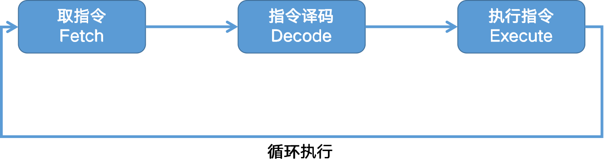

# 18th

一条指令执行的过程可以拆分为 3 个阶段：取指令（Fetch）、指令译码（Decode）、执行指令（Execute）。

取指令是把指令从内存加载到 CPU 的指令寄存器中；指令译码是将指令解析成具体的操作，比如操作哪些寄存器、数据或内存地址；执行指令就是实际去执行这些操作，比如进行算术逻辑操作、数据传输或者直接的地址跳转。

前两个步骤由控制器完成，第三步由算术逻辑单元（ALU），也就是运算器完成。不过，如果是一个简单的无条件地址跳转，那么可以直接在控制器里面完成，不需要用到运算器。

我们把这样的「Fetch - Decode - Execute」循环叫做指令周期。

计算机执行指令的过程就是不断地重复指令周期的过程。

