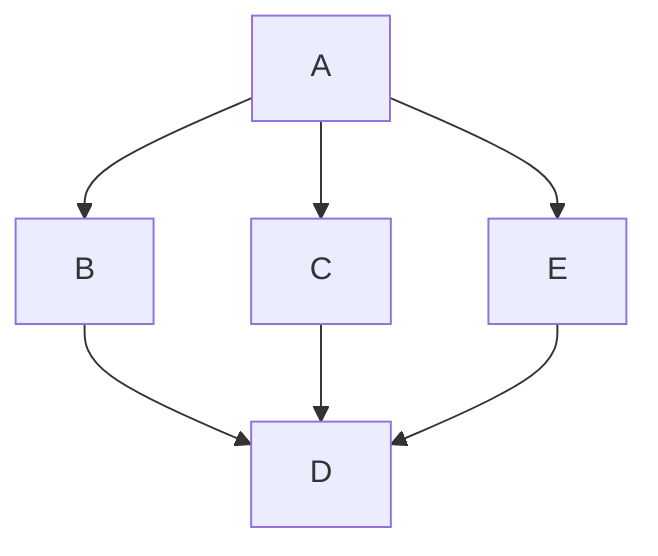
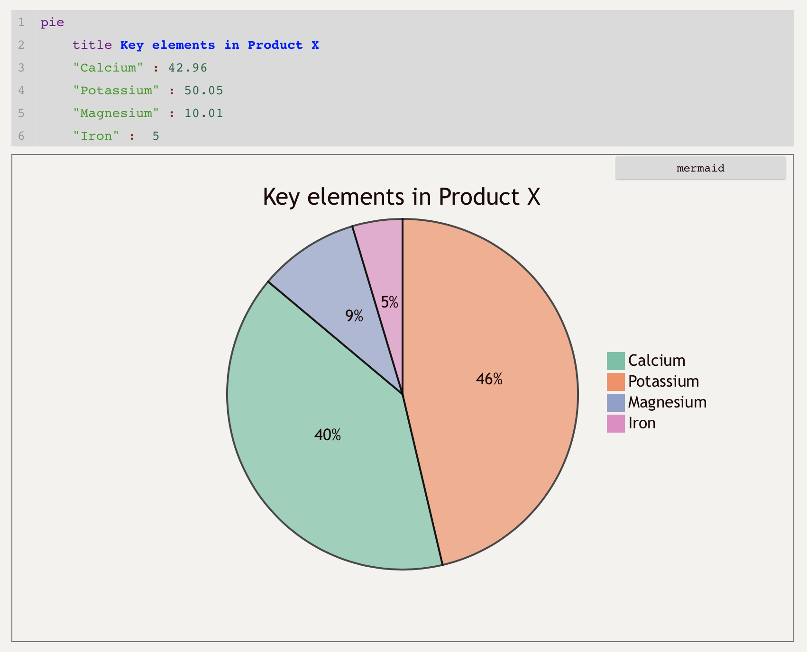

# 21st

最近被朋友安利了一个叫 Mermaid 的画图工具，一入坑发现真好用！它是类似于 HTML 的标记语言，不要一听到「语言」就腿发软哈，Mermaid 的语法很简单，比 Markdown 的语法还简单。而且 Mermaid 的功能也很强大，支持很多种类型的图，比如流程图、ER 图、类图、甘特图等。具体教程可以看它的官方文档：[https://mermaid-js.github.io/mermaid](https://mermaid-js.github.io/mermaid/#/)

Mermaid 必须得嵌入到 Markdown 文件中才行。把下面这段代码复制到 Markdown 文件中，就可以绘制一个简单的流程图（图一）：

```text

```

用这种标记语言画图的好处就是大大降低了维护的成本。比如你千辛万苦画好了一个流程图，然后突然发现中间漏了一个节点，那你为了补上这个节点，又要拖来拖去的修改，手动调整布局，想想就恶心。但是用标记语言画图的话，也许只需添加一行代码就可以。

比如图一的流程图，如果想加一个与 B、C 并列的节点 E，E 也指向 D，那么把上面的代码稍微改一下就可以：

```text

```

效果如图二所示。Mermaid 在渲染时自动帮你调整了布局，比手动调整效率高很多。

图三四五六展示了 Mermaid 支持的其他类型的图。




